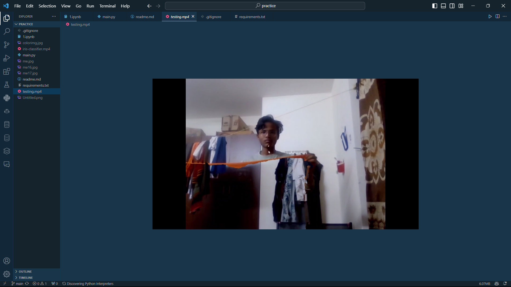
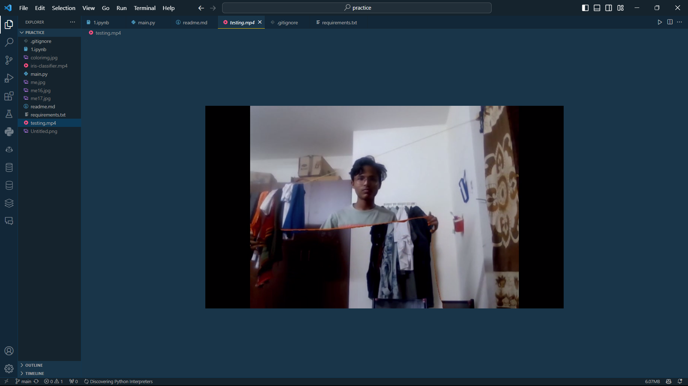
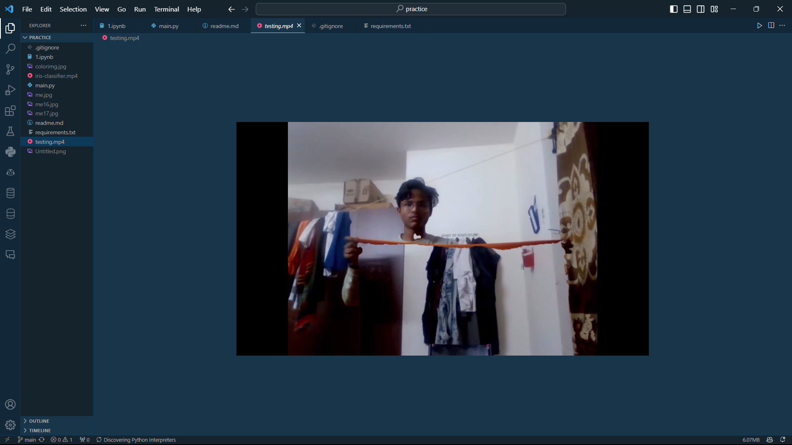

# Invisible Cloak using OpenCV

This project implements a simple "invisible cloak" effect using OpenCV. The concept is inspired by the famous invisibility cloak from the Harry Potter series. The program captures a background image, detects a specific color (in this case, using a color tracker), and replaces that color with the background image in real-time, creating a cloak-like effect.

## Features

- **Color Tracker**: Use the color tracker to define the color range you want to make invisible.
- **Real-time Invisibility**: The program captures the specified color in real-time and replaces it with a pre-captured background image.

## Prerequisites

- Python 3.x
- OpenCV library (`pip install opencv-python`)
## Screenshots

<video width="640" height="480" controls>
  <source src="./testing.mp4" type="video/mp4">
  
</video>

## Usage

1. Run the `colortracker` function by executing the script. Adjust the trackbars to define the color range you want to track.
2. Press 'f' to capture the background image when you're ready.
3. Comment out the `colortracker` function call and uncomment the `invisible_cloak` function call in the `main` function.
4. Run the script again to activate the invisible cloak effect.
5. Press 'q' to exit the program.

## Note

- Make sure your background image (`me16.jpg` in this case) is captured without any objects of the color you want to make invisible.

Feel free to customize the code according to your needs or expand upon the features. Happy coding!
